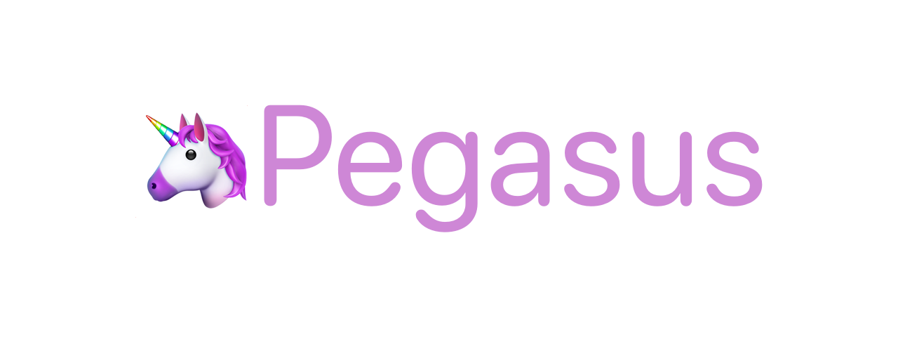

Pegasus is a utility bot that was primarily created for a small discord server that my friends and I are on. The end goal is to create a helper that allows us to schedule events, look up relevant information and offer some other fun features.

The bot is written in JavaScript (tested with Node 18.8) and is meant to run in a container environment for easy deployment. The primary storage backend for the bot's actions is a SQLite3 database right now, although this might be changed in a future version to make scaling easier.

## 🗺️ Roadmap

* [x] Event scheduling assistant

* [x] Magic The Gathering card lookup

* [ ] Extended polls / voting

* [ ] Rich-message tamagochi

## ⚖️ License

Distributed under the ISC license. For further information, see `LICENSE`.

## ✉️ Contact

Kathrin De Cecco - [@kad@mastodon.lol](https://mastodon.lol/@kad)

Project Link: [https://github.com/kathrindc/pegasus](https://github.com/kathrindc/pegasus)
